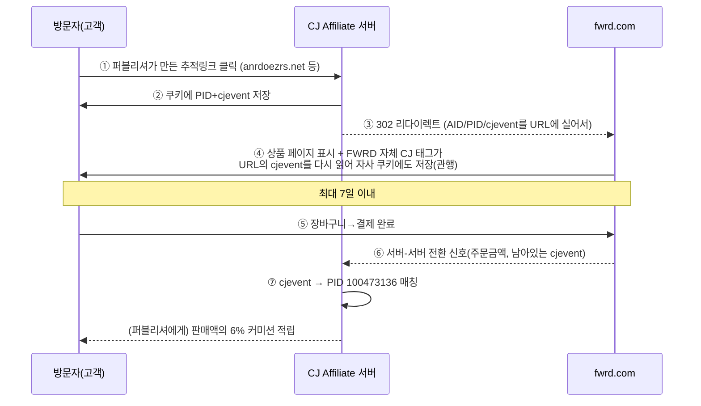

# 수익링크 심층 분석 — FWRD 링크 케이스 (2026-09-09)

> 요청하신 링크: `https://www.fwrd.com/product-on-cloud-6-geo-wp-in-black/ONF-MZ600/?d`
> 결과: **현재 404(품절/삭제)**. FWRD는 한정 재고형 셀렉트샵이라 팔린 상품은 URL 자체가 사라집니다 — 딜온도가 수집한 링크도 시간이 지나면 이런 식으로 죽는 게 정상입니다(버그 아님).
> 대신 **효종님이 실제로 카톡방에서 받으셨던 살아있는 FWRD 제휴 링크**를 그대로 해부했습니다(8/20~9/2 대화 분석 때 수집된 실제 데이터):
>
> ```
> https://www.fwrd.com/mens-sale-all-sale-items/650eb6/
>   ?cjdata=MXxOfDB8WXww
>   &navsrc=main
>   &AID=11120388
>   &PID=100473136
>   &utm_medium=affiliate
>   &utm_source=cj
>   &source=cj
>   &utm_campaign=glob_p_4467073
>   &cjevent=115db0d59c6811f1804800f60a18ba72
> ```

---

## 1. 파라미터 해부

| 파라미터 | 값 | 의미 |
|---|---|---|
| **AID** | 11120388 | CJ Affiliate가 부여한 **광고주(FWRD) ID**. "이 클릭은 FWRD 프로그램 소속"이라는 표시. |
| **PID** | 100473136 | ★ CJ가 부여한 **퍼블리셔(제휴사) ID**. **커미션이 실제로 입금되는 계좌를 가리키는 번호**입니다. 이 링크를 처음 만든 퍼블리셔(아마 딜뉴스류 사이트) 소유. |
| **cjevent** | 115db0d5...ba72 | ★ 클릭 순간 CJ 서버가 발급하는 **1회성 클릭 도장**. 쿠키에 저장되고, 나중에 구매가 일어나면 이 값으로 "누구 클릭이 이 매출을 만들었나"를 역추적합니다. |
| **cjdata** | MXxOfDB8WXww | base64 디코드하면 `1\|N\|0\|Y\|0` — CJ 내부용 메타데이터(디바이스·신규고객 여부 등 추정 플래그). 커미션 계산엔 직접 관여하지 않는 부가 태그. |
| **utm_source/medium/campaign** | cj / affiliate / glob_p_4467073 | CJ가 아니라 **FWRD 자체 구글 애널리틱스용** 태그. 커미션 귀속과는 별개 시스템. |

**PID는 절대 그대로 재사용하면 안 됩니다** — 저 번호는 이 링크를 최초로 만든 제3자(딜 사이트/인플루언서)의 계좌입니다. 효종님이 이 링크를 그대로 딜온도에 뿌리면, 클릭·구매가 일어나도 **커미션은 그 제3자에게 갑니다.** 효종님 몫을 받으려면 효종님 명의의 PID로 새로 만든 링크가 필요합니다(4번 참고).

---

## 2. 클릭 한 번이 돈이 되는 전체 흐름



1. 퍼블리셔가 CJ 대시보드(또는 스마트링크 서비스)로 만든 추적 링크는 사실 **CJ 소유 도메인**(`anrdoezrs.net` / `dpbolvw.net` / `kqzyfj.com` / `tkqlhce.com` / `jdoqocy.com` 등, 광고주마다 배정이 다름)을 거칩니다. fwrd.com으로 바로 가는 게 아니라 CJ 서버를 한 번 찍고 갑니다.
2. 이 순간 CJ가 **쿠키를 심고 cjevent를 발급**합니다. 동시에 fwrd.com으로 302 리다이렉트하면서 AID/PID/cjevent를 그대로 URL에 실어 보냅니다 — 이게 바로 효종님이 받은 링크가 이미 fwrd.com 도메인인데도 CJ 파라미터를 달고 있는 이유입니다(1차 리다이렉트는 이미 끝난 상태의 링크였던 것).
3. FWRD 사이트 자체에도 CJ의 "Universal Tag"가 심어져 있어서, URL에 묻어온 cjevent를 다시 읽어 **자사 도메인 쿠키로도 한 번 더 저장**합니다(서드파티 쿠키가 차단돼도 살아남게 하는 관행 — "랜딩페이지 태깅").
4. FWRD는 쿠키 유효기간 **7일**(getlasso.co 확인) — 이 안에 결제까지 가야 커미션이 인정됩니다.
5. 결제 완료 페이지에서 FWRD 서버가 CJ로 "주문 성사" 신호를 보내고, CJ가 남아있는 cjevent로 원래 클릭(=PID)을 찾아 **판매액의 6%**를 그 퍼블리셔 계정에 적립합니다.
6. **최종 클릭이 이긴다(last-click)** — 같은 사람이 나중에 다른 제휴 링크(또는 FWRD 자체 광고)를 한 번 더 클릭하면 귀속이 그쪽으로 넘어갈 수 있습니다.

---

## 3. FWRD 프로그램 조건 요약 (2026 기준)

| 항목 | 내용 |
|---|---|
| 네트워크 | CJ Affiliate (Commission Junction) |
| 커미션율 | 판매액의 **6%** |
| 쿠키 기간 | **7일** |
| 환불/반품 시 | 커미션 취소(일반적 관행) |

앞서 분석하신 Mytheresa(8%, 30일)보다 **쿠키 기간이 짧고 요율도 살짝 낮습니다** — FWRD 딜은 "본 순간 바로 사는" 임팩트가 Mytheresa류보다 더 중요하다는 뜻이라, 텔레그램 알림을 **더 즉시성 있게**(FLASH 우선순위) 보내는 게 실제 수익과도 맞아떨어집니다.

---

## 4. 딜온도 파이프라인에 적용

`data/affiliate.csv`를 확인해보니 **현재 활성화된 머천트 템플릿이 하나도 없습니다** (전부 주석 예시뿐). 즉 지금 나가는 FWRD 딜 링크는 (RADAR_SKIMLINKS_ID/RADAR_SOVRN_KEY를 GitHub 시크릿에 넣어두셨다면 스마트링크로, 안 넣으셨다면 완전히 맨 링크로) 나가고 있을 겁니다.

**FWRD를 CJ로 직접 승인받으신 뒤** 아래 형식으로 `data/affiliate.csv`에 한 줄 추가하시면 됩니다(효종님 계정의 실제 PID로 교체):

```
fwrd.com,CJ,https://www.anrdoezrs.net/click-<YOUR_PID>-<FWRD_LINK_ID>?url={url}
```

정확한 `<FWRD_LINK_ID>`와 리다이렉트 도메인은 CJ 대시보드에서 FWRD 프로그램 페이지 → "Get Links" → 딥링크 생성기에 상품 URL을 넣으면 자동으로 만들어줍니다(로그인 필요라 제가 대신 볼 수는 없습니다).

**승인 전이라도 당장 수익화하려면**: 이미 만들어둔 스마트링크 폴백(Skimlinks/Sovrn)이 FWRD도 자동으로 커버합니다 — `수익링크_분석.md`에 정리된 "방법 B" 그대로입니다. CJ 개별 승인은 시간이 걸리니, 스마트링크를 먼저 켜두고 FWRD처럼 자주 나오는 머천트부터 순서대로 직접 승인 전환하시는 걸 권장드립니다.

---

## Sources
- [FWRD Affiliate Program: Commission & Program Details (2026)](https://getlasso.co/affiliate/fwrd/)
- [CJ Affiliate (Commission Junction) — Wikipedia](https://en.wikipedia.org/wiki/CJ_Affiliate)
- 카카오톡 대화 실측 데이터(2026-08-20~09-02 분석, 효종님이 공유하신 FWRD 링크)
